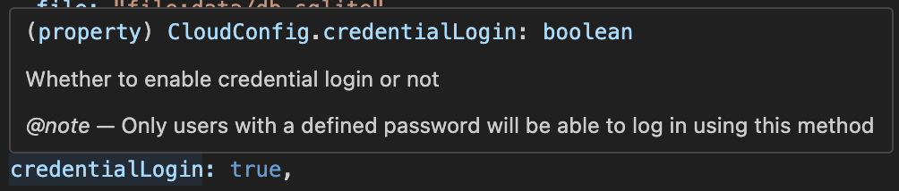

# Configuration

There are 3 essential configuration files: `clientconfig.ts`, `config.ts` and `.env.{development, production}`. The last one is actually two separate files but are following the same structure just for development or production environment. More about it later.


It is recommended to use an IDE with typescript support like [VSCode](https://code.visualstudio.com) so you are sure you get all the types right. You can hover on certain values to see a fancy description like this:




### Let's start with `clientconfig.ts`!

> clientconfig is the configuration that will be used mainly for client side information like the website name and such.

If you followed the [installation.md](installation.md "mention"), you should already have a ready to use config that looks like this:

```typescript
export default {
  mainPageAllowed: true,
  websiteName: "CloudVoxel",
  websiteURL: process.env.AUTH_URL || "http://localhost:3000",
  websiteDescription: "An Open-Source local-first solution to file sharing.",
  websiteLogo: "/siteicon.png",
  maxFileSize: "1000 MB",
  maxFileCount: 25,
  instantUpload: true,
  maxParallelUploads: 2,
  allowImagePreview: false,
  allowFileMetadata: false,
} as ClientConfig;
```

This is the default and recommended configuration. The main values you may want to change are `websiteName`, `websiteDescription` and `maxFileSize`. Other than that, you may want try tweaking the other values using the dev server to play around and see!


Have you seen the `websiteLogo` value? You probably also want to change that one too! For that, look in the `public` folder where you will find this `siteicon.png` file. Replace it with yours!



Note: certain values will only change client side behavior like `maxFileCount` that will only define how many files can be uploaded at once client side but it won't define server side behavior (yet).


### Let's continue with `config.ts`.

> `config.ts` is at the core of CloudVoxel and defines how your server functions.

By default, it should look like this:

```typescript
export default {
  root: "./storage",
  providers: ["Discord", "GitHub"],
  database: {
    file: "file:data/db.sqlite",
    globFileBlacklist: [".DS_Store", "thumbs.db", "desktop.ini"],
  },
  enableAPI: true,
  enableExperimentalPasskeys: false,
  credentialLogin: false,
  logs: {
    console: true,
    folder: "./logs",
    fileFormat: "YYYY-MM-DD.log",
  },
} satisfies CloudConfig as CloudConfig;

```

Everything is detailed when hovering on the keys on an IDE like said previously.\
-> For help about the `root` key, check out the [partitions.md](partitions.md "mention") guide.\
-> The current available providers are: <kbd>Discord</kbd>, <kbd>GitHub</kbd>, <kbd>GitLab</kbd>, <kbd>Google</kbd>, <kbd>Osu!</kbd>, <kbd>Slack</kbd>, <kbd>Twitch</kbd>, <kbd>Reddit</kbd>.\
-> You can enable the API and the Passkeys as well as logging in with credentials by setting the corresponding keys to `true` or `false`.\
-> About the logs: by default, console and file logging is enabled. To disable the console logging, set `console` to `false` and to disable the file logging, set `folder` to `false`.

For help about adding users, read the [#user-management](cli.md#user-management "mention") guide in the CLI.

### And end with `.env`!

You have two `.env` files: `.env.development` and `.env.production`. For the development one, you can either have it the same as the production configuration or create new IDs and SECRETs.

The file structure looks like this:

```sh
AUTH_URL="http://localhost:3000" # URL of your Auth server, keep localhost for development
AUTH_SECRET="" # Add with `npx auth secret --raw`. Read more: https://cli.authjs.dev

# https://authjs.dev/getting-started/providers/discord
AUTH_DISCORD_ID=""
AUTH_DISCORD_SECRET=""

# https://authjs.dev/getting-started/providers/github
AUTH_GITHUB_ID=""
AUTH_GITHUB_SECRET=""
```

For `AUTH_URL`, it is recommended to use `http://localhost:3000` on the development server and use the real URL on the production one.

Then, you have to generate an `AUTH_SECRET`. It is a random string that will be used by the server, keep it private like all the other secrets! You can generate one by running `bunx auth secret --raw` in your console and copy pasting the result.

Then you have all the providers available with their respective link. You will find all the resources you need online from the link above. All you have to do usually is create an application on that site, copy it's ID and SECRET and paste it in your `.env`.


You do not need to specify IDs and SECRETs for every provider, only the one you enabled in your `config.ts` if any.


***

And that's it! You reached the end of the configuration! You can now start your server as you will see here: [starting-the-server.md](starting-the-server.md "mention").
