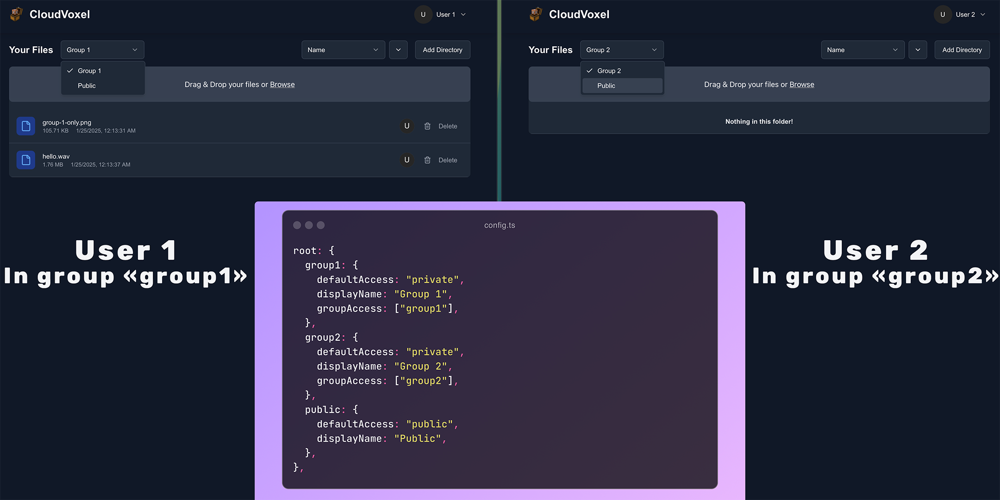

# Partitions

<figure><figcaption><p>Two different accounts in different groups having access to different partitions as seen in the config.</p></figcaption></figure>

Partitions are great, but maybe you do not need them. So before enabling or disabling it, read what it does!

#### What are partitions?

Partitions are a way of splitting up the storage into "root folders". You can have multiple partitions and every partition has a maximum size and only certain group of users (see [#group-management](cli.md#group-management "mention")) have access to that specific partition. If you want everyone to have access to everything, consider disabling partitions. If you have multiple groups that should only see certain folders, create partitions.

***


When disabling or enabling partitions, it is recommended migrating your previous storage.

If you change from partitions enabled to disabled, just run the **sync** script in the CLI: [#sync-files](cli.md#sync-files "mention").

If you change from partitions disabled to enabled, consider moving the previous storage to a partition and then syncing the files with the CLI.


## Disabling partitions

No partitions means a simple root folder where everything will be stored. For that, open your `config.ts` and set the <kbd>root</kbd> key to either a relative path like `./storage`, or an absolute path to the folder. Easy as that!

## Enabling partitions

Partitions come with a permission idea in mind. You have two main types of partitions: public and private ones. Public are accessible to anyone whitelisted whereas private ones are only accessible to users in the whitelisted group to that partition. If that sounds complex, don't worry it's actually pretty simple.

### Adding a public dummy partition

Let's start by adding a dummy public partition!

<pre class="language-typescript"><code class="lang-typescript"><strong>export default {
</strong>  root: {
    public: {
      path: "./storage/public",
      defaultAccess: "public",
      displayName: "Dummy Public",
      maxPartitionSize: "10 MB", // You can optionally remove this line to disable partition size limit
    },
  },
  // the rest of your config...
}
</code></pre>

<figure><figcaption><p>That's how it should look like if you run your server now. Every user should see this!</p></figcaption></figure>

### Adding a private dummy partition

Now let's go ahead and add a private partition. Let's say only the `orange` and `red` groups can access it.

```typescript
export default {
  root: {
    // previous groups...
    private: {
      path: "./storage/private",
      defaultAccess: "private",
      displayName: "Dummy Private",
      groupAccess: ["orange", "red"],
      maxPartitionSize: "100 MB",
    },
  },
  // the rest of your config...
}
```

Here, only the group with the ID `orange` or `red` will be able to access this partition. Groups can be managed from the CLI: [#group-management](cli.md#group-management "mention").

<figure><figcaption><p>That's how it should look like if you run your server now<br>(only in the "orange" or "red" group).</p></figcaption></figure>

And there you go! You know have everything you need for making partitions on your own for your needs!
