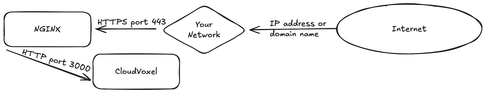

# Starting the server


Documentation for this part is not written yet. Coming soon!


### Starting for production

This is probably what you are looking for! After setting up your configuration and your `.env.production`, you can start your instance for production!

Here's how it works: you first have to build the code —this is a required step to optimize and make everything ready— and then start it. Here's how:

```bash
bun run build
```


You'll have to re-build for each change you make to the code. If you want to change the code a lot, consider using [#starting-in-development-mode](starting-the-server.md#starting-in-development-mode "mention").


And now, like every other time you want to start the instance, run the start command:

```bash
bun run start
```

And it should look like this:

```yaml
$ next start
   ▲ Next.js 15.1.6
   - Local:        http://localhost:3000
   - Network:      http://[your local network IP]:3000

 ✓ Starting...
 ✓ Ready in 202ms
```

This is great! Your instance is now accessible on your network! But what if you want it to be available from the whole internet?

<figure><figcaption><p>An oversimplified representation of the "network structure" of CloudVoxel.</p></figcaption></figure>

CloudVoxel does not support HTTPS built-in because NextJS doesn't. You'll have to use a reverse proxy such as [NGINX](https://nginx.org/en/) to handle the HTTPS certification. You can find many tutorials online like [this one](https://gist.github.com/kocisov/2a9567eb51b83dfef48efce02ef3ab06).

<details>

<summary>Example NGINX Config</summary>

```toml
# /etc/nginx/sites-available/example.com

# HTTP -> HTTPS redirect
server {
    listen 80;
    server_name example.com;

    # Redirect all HTTP traffic to HTTPS
    return 301 https://$server_name$request_uri;
}

# HTTPS configuration
server {
    listen 443 ssl http2;
    server_name example.com;

    # SSL configuration
    ssl_certificate /etc/letsencrypt/live/example.com/fullchain.pem;
    ssl_certificate_key /etc/letsencrypt/live/example.com/privkey.pem;

    # Recommended SSL settings
    ssl_protocols TLSv1.2 TLSv1.3;
    ssl_ciphers ECDHE-ECDSA-AES128-GCM-SHA256:ECDHE-RSA-AES128-GCM-SHA256:ECDHE-ECDSA-AES256-GCM-SHA384:ECDHE-RSA-AES256-GCM-SHA384:ECDHE-ECDSA-CHA>
    ssl_prefer_server_ciphers off;

    # SSL session settings
    ssl_session_timeout 1d;
    ssl_session_cache shared:SSL:50m;
    ssl_session_tickets off;

    # Allow large file upload - Don't forget to change this for bigger uploads
    client_max_body_size 1000M;

    # Proxy settings for Next.js
    location / {
        proxy_pass http://localhost:3000;  # Assuming Next.js runs on port 3000
        proxy_http_version 1.1;
        proxy_set_header Upgrade $http_upgrade;
        proxy_set_header Connection 'upgrade';
        proxy_set_header Host $host;
        proxy_cache_bypass $http_upgrade;
        proxy_set_header X-Real-IP $remote_addr;
        proxy_set_header X-Forwarded-For $proxy_add_x_forwarded_for;
        proxy_set_header X-Forwarded-Proto $scheme;

        # WebSocket support
        proxy_set_header Connection "upgrade";
    }

    # Security headers
    add_header X-Frame-Options "SAMEORIGIN" always;
    add_header X-XSS-Protection "1; mode=block" always;
    add_header X-Content-Type-Options "nosniff" always;
    add_header Referrer-Policy "no-referrer-when-downgrade" always;

    # Gzip compression
    gzip on;
    gzip_vary on;
    gzip_proxied any;
    gzip_comp_level 6;
    gzip_types text/plain text/css text/xml application/json application/javascript application/rss+xml application/atom+xml image/svg+xml;
}

```

</details>


When using this example config, don't forget to change the `client_max_body_size` value to allow smaller or bigger file uploads!


### Starting in development mode

After setting up `.env.development`, you can run your development server like this:

```
bun run dev
```

And you should see a little something like this and you can visit [http://localhost:3000](http://localhost:3000) to check out your app!

```yaml
$ next dev
   ▲ Next.js 15.1.6
   - Local:        http://localhost:3000
   - Network:      http://[your local network IP]:3000
   - Environments: .env.development

 ✓ Starting...
 ✓ Ready in 1377ms
```
